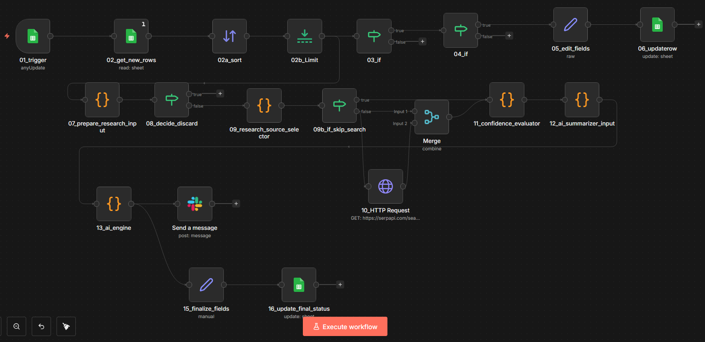

# Investigador de Leads – n8n Automation

Automatización desarrollada en **n8n** que implementa un flujo determinista para investigación y clasificación de leads, con control explícito de estado y simulación de motor de decisión tipo IA.

---

## 📌 Objetivo

Automatización:

Google Sheets (leads en estado NEW)  
→ Validación  
→ Búsqueda / evaluación  
→ Motor AI simulado (determinista)  
→ Envío a Slack  
→ Actualización de estado en Google Sheets (DONE / DISCARDED)

---

## 🏗 Arquitectura del flujo

1. **Trigger** desde Google Sheets  
2. Selección de 1 lead con status NEW  
3. Validaciones mínimas (nombre, rol, URL)  
4. Evaluación de confianza  
5. Motor AI simulado (determinista, sin costos externos)  
6. Envío a Slack  
7. Actualización de estado final en Google Sheets  

El flujo procesa **un lead por ejecución** para mantener consistencia y control de estado.

---

## 🤖 Motor AI (Simulado)

Para evitar dependencias pagadas, el nodo `13_ai_engine` implementa lógica determinista que incluye:

- Normalización de score (0–1)
- Umbral mínimo de confianza
- Generación de `summary_1liner`
- Generación de `risks_flags`
- Determinación de `final_status_suggested`

No utiliza modelos externos.  
El comportamiento es reproducible, trazable y reemplazable por un modelo real si se desea.

---

## 📂 Archivos

- `investigador-leads-workflow.json` → Export completo del workflow n8n
- `workflow.png` → Captura de arquitectura del flujo

---

## 🧠 Características técnicas

- Flujo determinista
- Procesa 1 lead por ejecución
- Control explícito de estado (NEW → DONE / DISCARDED)
- Separación de responsabilidades por nodo
- Arquitectura desacoplada
- Simulación de motor AI reemplazable
- Integración con Google Sheets y Slack

---

## 🚀 Cómo usar

1. Importar el archivo JSON en n8n  
2. Configurar credenciales de Google Sheets  
3. Configurar credenciales de Slack  
4. Ejecutar el workflow  

---

## 📌 Estado del Proyecto

Proyecto funcional y estable.

Preparado para reemplazar el motor simulado por un modelo de IA real si se requiere.
